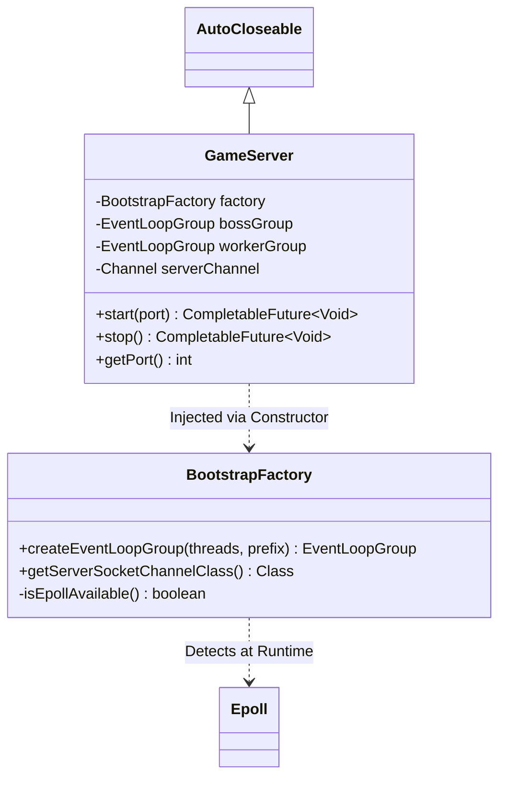

# Technical Design: Network Kernel (Phase 1)

**Status:** APPROVED
**Component:** `net-bullet` Core

## 1. Architecture
The kernel implements a **Micro-Bootstrap** architecture. This pattern decouples the *OS-specific transport configuration* from the *server lifecycle management*, allowing the application to be portable (Write Once, Run Anywhere) while retaining native performance on Linux.

## 2. Component Specifications

### 2.1 BootstrapFactory (`com.netbullet.net`)
* **Responsibility:** Abstracting the underlying Netty Transport implementation.
* **Selection Logic:**
  * **IF** `Epoll.isAvailable()` (Linux/x86_64, Linux/aarch64) **THEN** use `EpollEventLoopGroup` / `EpollServerSocketChannel`.
  * **ELSE** (Windows, MacOS) **THEN** use `NioEventLoopGroup` / `NioServerSocketChannel`.
* **Thread Naming:** Must inject a custom `ThreadFactory` to ensure threads are named `boss-0`, `worker-1`, etc., rather than default `nioEventLoopGroup-2-1`. This is critical for debugging dumps.

### 2.2 GameServer (`com.netbullet.net`)
* **Responsibility:** Managing the TCP listening socket and reactor threads.
* **Lifecycle Contract:**
  * **Start:** Asynchronous. Returns a `CompletableFuture` that completes *only* when the socket is successfully bound to the OS port.
  * **Stop:** Asynchronous. Triggers `shutdownGracefully()` on both LoopGroups.
* **Resource Safety:** Implements `AutoCloseable`. The `close()` method acts as a synchronous bridge to `stop().join()`, ensuring it can be used in `try-with-resources` blocks.

## 3. Data Flow

### 3.1 Startup Sequence
1.  **User** calls `new GameServer(new BootstrapFactory())`.
2.  **User** calls `server.start(port)`.
3.  **GameServer** requests `boss` and `worker` groups from the Factory.
4.  **Netty** attempts to bind to `0.0.0.0:port`.
  * *Success:* The `serverChannel` is stored, and the Future completes successfully.
  * *Failure:* The Exception (e.g., `BindException`) is captured, logged, and the Future completes exceptionally.

### 3.2 Connection Handling (Phase 1)
1.  **Client** connects to the port.
2.  **OS Kernel** accepts TCP handshake.
3.  **Boss Thread** accepts the connection and hands it to a **Worker Thread**.
4.  **Worker Thread** initializes the pipeline (Currently empty/noop for Phase 1).

## 4. Error Handling Strategy

| Scenario | Detection | Mitigation |
| :--- | :--- | :--- |
| **Port Occupied** | `BindException` during startup | Propagate exception via Future. Do not crash JVM. Log friendly error. |
| **Privileged Port** | `PermissionDeniedException` (Ports < 1024) | Propagate exception. Log hint about `sudo`. |
| **Resource Leak** | `GameServer` garbage collected without `stop()` | (Future) Use `Cleaner` API or Netty `ResourceLeakDetector`. |
| **Shutdown Hang** | `stop()` called while I/O active | Netty `shutdownGracefully` guarantees 2s quiet period before force kill. |