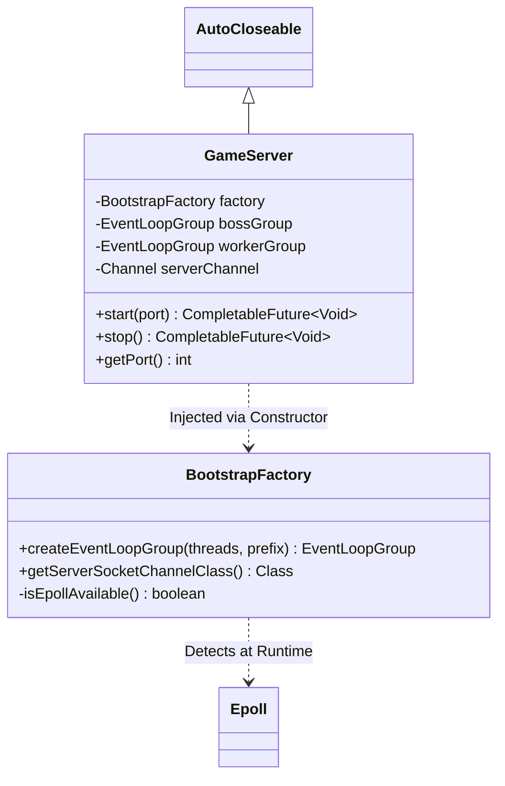

# Technical Design: Network Kernel (Phase 1)

**Status:** APPROVED
**Component:** `net-bullet` Core

## 1. Architecture
The kernel implements a **Micro-Bootstrap** architecture. This pattern decouples the *OS-specific transport configuration* from the *server lifecycle management*, allowing the application to be portable (Write Once, Run Anywhere) while retaining native performance on Linux.

```mermaid
classDiagram
    class BootstrapFactory {
        +createEventLoopGroup(threads, prefix) EventLoopGroup
        +getServerSocketChannelClass() Class
        -isEpollAvailable() boolean
    }
    class GameServer {
        -BootstrapFactory factory
        -EventLoopGroup bossGroup
        -EventLoopGroup workerGroup
        -Channel serverChannel
        +start(port) CompletableFuture~Void~
        +stop() CompletableFuture~Void~
        +getPort() int
    }

%% Relationships
    AutoCloseable <|-- GameServer
    GameServer ..> BootstrapFactory : Injected via Constructor
    BootstrapFactory ..> Epoll : Detects at Runtime
```

## 2. Component Specifications

### 2.1 BootstrapFactory (`com.netbullet.net`)
* **Responsibility:** Abstracting the underlying Netty Transport implementation.
* **Selection Logic:**
  * **IF** `Epoll.isAvailable()` (Linux/x86_64, Linux/aarch64) **THEN** use `EpollEventLoopGroup` / `EpollServerSocketChannel`.
  * **ELSE** (Windows, MacOS) **THEN** use `NioEventLoopGroup` / `NioServerSocketChannel`.
* **Thread Naming:** Must inject a custom `ThreadFactory` to ensure threads are named `boss-0`, `worker-1`, etc., rather than default `nioEventLoopGroup-2-1`. This is critical for debugging dumps.

### 2.2 GameServer (`com.netbullet.net`)
* **Responsibility:** Managing the TCP listening socket and reactor threads.
* **Lifecycle Contract:**
  * **Start:** Asynchronous. Returns a `CompletableFuture` that completes *only* when the socket is successfully bound to the OS port.
  * **Stop:** Asynchronous. Triggers `shutdownGracefully()` on both LoopGroups.
* **Resource Safety:** Implements `AutoCloseable`. The `close()` method acts as a synchronous bridge to `stop().join()`, ensuring it can be used in `try-with-resources` blocks.

## 3. Data Flow

### 3.1 Startup Sequence
1.  **User** calls `new GameServer(new BootstrapFactory())`.
2.  **User** calls `server.start(port)`.
3.  **GameServer** requests `boss` and `worker` groups from the Factory.
4.  **Netty** attempts to bind to `0.0.0.0:port`.
  * *Success:* The `serverChannel` is stored, and the Future completes successfully.
  * *Failure:* The Exception (e.g., `BindException`) is captured, logged, and the Future completes exceptionally.

### 3.2 Connection Handling (Phase 1)
1.  **Client** connects to the port.
2.  **OS Kernel** accepts TCP handshake.
3.  **Boss Thread** accepts the connection and hands it to a **Worker Thread**.
4.  **Worker Thread** initializes the pipeline (Currently empty/noop for Phase 1).

## 4. Error Handling Strategy

| Scenario | Detection | Mitigation |
| :--- | :--- | :--- |
| **Port Occupied** | `BindException` during startup | Propagate exception via Future. Do not crash JVM. Log friendly error. |
| **Privileged Port** | `PermissionDeniedException` (Ports < 1024) | Propagate exception. Log hint about `sudo`. |
| **Resource Leak** | `GameServer` garbage collected without `stop()` | (Future) Use `Cleaner` API or Netty `ResourceLeakDetector`. |
| **Shutdown Hang** | `stop()` called while I/O active | Netty `shutdownGracefully` guarantees 2s quiet period before force kill. |

## 5. Phase 2: Architecture - The ECS Bridge
To achieve "Industrial Grade" performance, the network layer and the game simulation layer operate in complete isolation, communicating only via concurrent queues.

### 5.1 System Diagram
```mermaid
flowchart TD
    subgraph Netty IO [Netty Worker Thread]
        A[TCP Socket] --> B[LengthFieldBasedFrameDecoder]
        B --> C[PacketDecoder]
        C -->|Translates to Record| D[IngestionHandler]
    end

    subgraph The Bridge [Concurrent Boundary]
        E[(MpscArrayQueue / ConcurrentLinkedQueue)]
    end

    subgraph Simulation [Game Loop Thread]
        F[Tick Scheduler] --> G[Drain Queue]
        G --> H[Update Artemis-odb Components]
        H --> I[world.process()]
    end

    D -->|Push| E
    E -->|Poll| G
```

### 5.2 Component Specifications

#### 5.2.1 Protocol Framing (`com.netbullet.net.codec.FrameDecoder`)
* **Responsibility:** Reassembling fragmented TCP packets.
* **Design:** Extends Netty's built-in `LengthFieldBasedFrameDecoder`.
* **Header Format:** * `Length` (Unsigned Short, 2 bytes): Total length of the payload.
  * `Packet ID` (Byte, 1 byte): Opcode identifying the message type (e.g., 0x01 = MoveIntent).

#### 5.2.2 Packet Decoder (`com.netbullet.net.codec.PacketDecoder`)
* **Responsibility:** Converting raw byte buffers into domain objects.
* **Design:** Extends `ByteToMessageDecoder`. Uses a `switch` statement with Java 25 Pattern Matching on the Packet ID.
* **Output:** Instantiates pure Java `Record` types (e.g., `public record MoveIntent(int entityId, float dx, float dy) {}`).

#### 5.2.3 Ingestion Handler (`com.netbullet.net.handler.IngestionHandler`)
* **Responsibility:** Moving the decoded `Record` off the Netty thread and into the game state.
* **Design:** The final `ChannelInboundHandlerAdapter` in the pipeline. It holds a reference to a `Queue<IntentRecord>`. It calls `queue.offer(record)`. It contains zero logic and no blocking operations.

#### 5.2.4 The Game Loop (`com.netbullet.engine.GameLoop`)
* **Responsibility:** Running the ECS at a deterministic tick rate.
* **Design:** A dedicated platform thread (not a virtual thread, as it runs a continuous CPU-bound `while(running)` loop). Every tick, it polls the MPSC queue until empty, applies the intents to the relevant Artemis-odb components (e.g., adding a `VelocityComponent`), and then calls `world.process()`.