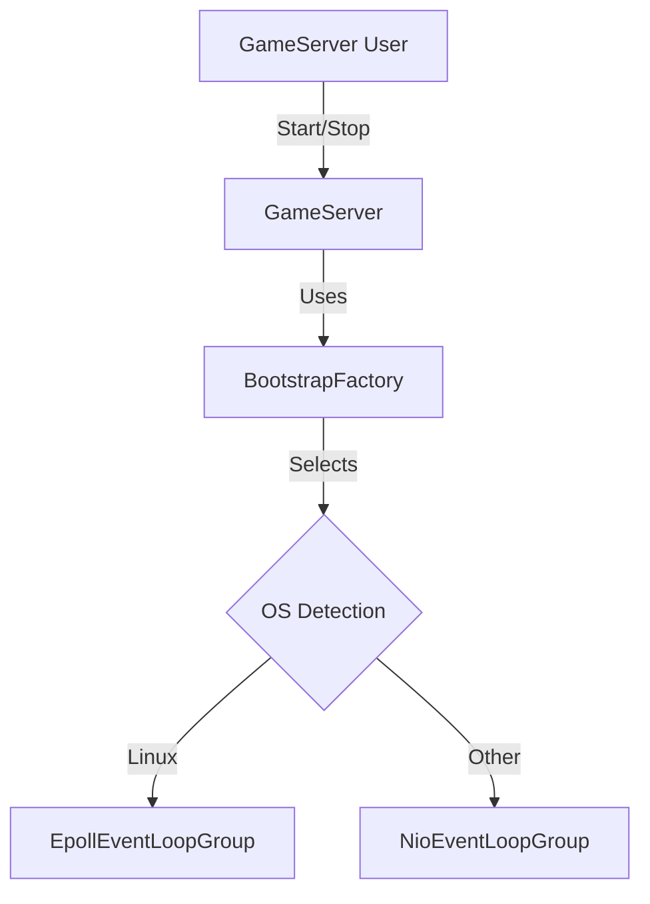

# Phase 1 Design Spec: The Network Kernel

**Status:** DRAFT
**Owner:** @PrincipalArchitect
**Target:** `net-bullet` Kernel

## 1. Executive Summary
The objective of Phase 1 is to establish the high-performance networking foundation for the game server. We will implement a specialized Netty transport layer that automatically selects the optimal I/O mechanism (Epoll for Linux/Prod, NIO for Mac/Windows/Dev) without code changes.

This phase transforms the empty project into a listening TCP server that passes all strict quality gates (SpotBugs, Checkstyle, PMD).

## 2. Architecture & Components

### 2.1 Component Diagram

### 2.2 Class Specifications

#### `com.netbullet.net.BootstrapFactory`

* **Responsibility:** Abstraction layer for Netty transport selection.
* **Behavior:**
* Checks `Epoll.isAvailable()` at runtime.
* Returns the native `EventLoopGroup` and `ServerSocketChannel` class if available.
* Falls back to standard Java NIO if native transport is unavailable.

* **Why:** Ensures developers on Mac/Windows can run the exact same code as the Linux production server.

#### `com.netbullet.net.GameServer`

* **Responsibility:** Application Lifecycle Management.
* **Interfaces:** Implements `AutoCloseable` to force strict resource cleanup compliance.
* **Key Methods:**
* `CompletableFuture<Void> start(int port)`: Async startup. Returns a future that completes only when the port is successfully bound.
* `CompletableFuture<Void> stop()`: Async shutdown. Gracefully terminates the EventLoopGroups.

## 3. Implementation Plan

### 3.1 Dependencies (`pom.xml`)

We must inject the engine fuel.

* **Dependency:** `io.netty:netty-all:4.1.115.Final` (or newer).
* **Rationale:** Provides access to both `netty-transport-native-epoll` and `netty-transport` in a single artifact.

### 3.2 Verification Strategy (The Test)

We will rely on a single, robust Integration Test (`GameServerIT`) to prove correctness. Unit testing the Netty library itself is redundant; we only test our usage of it.

**Scenario: `GameServerIT.java**`

1. **Arrange:** Instantiate `GameServer`.
2. **Act:**
* Call `start(0)` (Bind to ephemeral port).
* Wait for Future completion.
* Open `java.net.Socket` to `localhost:serverPort`.

3. **Assert:**
* Socket connects successfully (proving listener is active).
* `server.getPort()` returns a valid non-zero integer.

4. **Cleanup:** Call `stop()` and verify the port becomes unreachable.

## 4. Definition of Done (The Gate)

Phase 1 is complete only when the following criteria are met:

* [ ] **Build Health:** `mvn clean verify` passes with **zero** warnings.
* [ ] **Static Analysis:**
* **SpotBugs:** No resource leaks detected in `GameServer`.
* **Checkstyle:** No magic numbers (ports/threads must be constants or config).
* **PMD:** No empty catch blocks or unused fields.

* [ ] **Cross-Platform:** The `BootstrapFactory` correctly selects `Nio` on the local dev machine.
* [ ] **Test Coverage:** `GameServerIT` passes reliably on GitHub Actions (Ubuntu/Linux) and Local (Windows/Mac).
